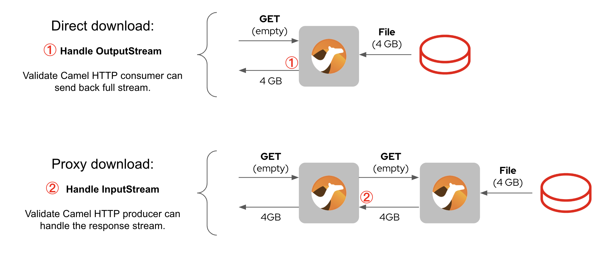
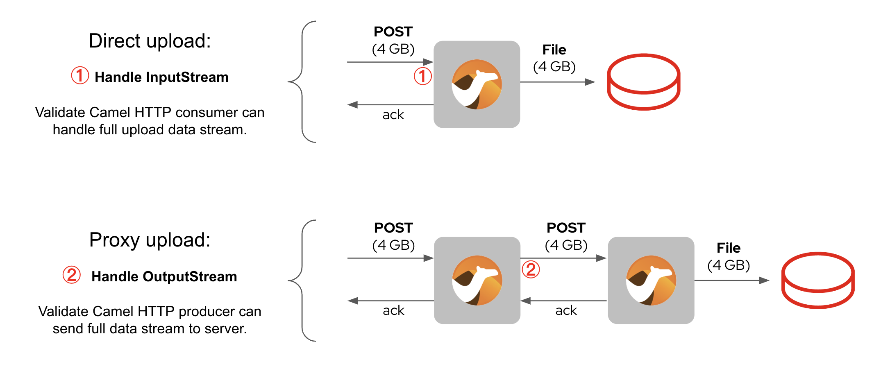

# Camel HTTP Streaming mode

This repository includes sample projects to validate Camel's ability to stream up/down large amounts of data via HTTP.

## Introduction

Typical HTTP interactions, normally via REST operations, send small/medium payloads. Traditional implementations preload in memory the full payload before processing kicks off.

For large payloads this approach is problematic because the JVM can quickly run out of memory, specially if handling multiple requests in parallel.

Streaming mode allows more efficient handling of large payloads, not requiring to load in memory the request in full.

The repository includes code to validate Camel's streaming mode for:
 - Camel Quarkus
 - Camel Spring Boot

 

## Use cases

This repository covers two basic scenarios using Camel in streaming mode:

- HTTP downloads
- HTTP uploads

Camel may act as the end system responsible to locally/remotely store the data stream. Or it may also act as a proxy system, passing the responsibility downstream.

!!! tip 
    dgfsgdf

> :information_source: fsdfsdf

Some **content** with _Markdown_ `syntax`. Check [this `api`](#).

The critical data handling happens in the numbered 1) and 2) positions illustrated below.

### Download scenario

### Upload scenario

 

## Contents

The repository organises both use cases (up/down) in separate folders. Each folder contains the following elements:

* Client:
  - Readme file with instructions to send data requests.
* Server (Quarkus)
  - Camel Quarkus implementation to accept upload/download requests.
  - Readme file with instructions to build/start/stop the engine.
* Server (Spring Boot)
  - Camel Spring Boot implementation to accept upload/download requests.
  - Readme file with instructions to build/start/stop the engine.
* Proxy (Quarkus)
  - Camel Quarkus implementation to proxy upload/download requests to a backend.
  - Readme file with instructions to build/start/stop the engine.
* Proxy (Spring Boot)
  - Camel Spring Boot implementation to proxy upload/download requests to a backend.
  - Readme file with instructions to build/start/stop the engine.

 

## Usage

You can use the client to send data requests directly against the server, or against the proxy which links with the backend server.

Select the download or upload use case you want to try out, change directory to the relevant folder where you will find the client, server and proxy.

Read the `Readme.txt` file included in each one of the elements to understand how to build/start/stop the engines.

The client includes information on how to generate test data (4GB by default). The input and output test data generated is located in a `data` folder. As you will be generating a lot of data, ensure you delete all the data when you're done.